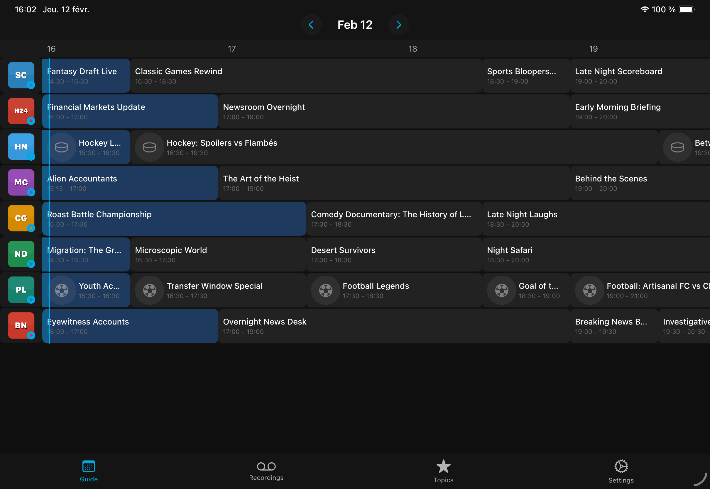
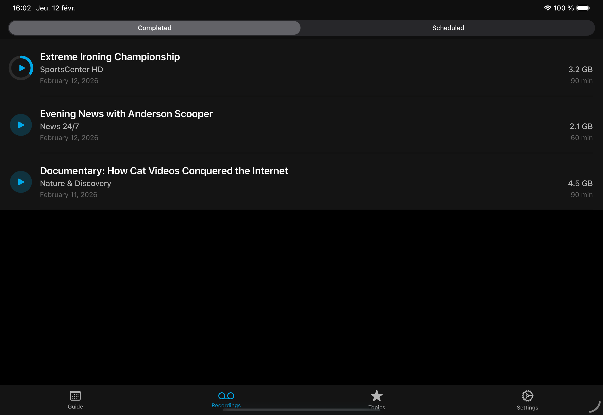
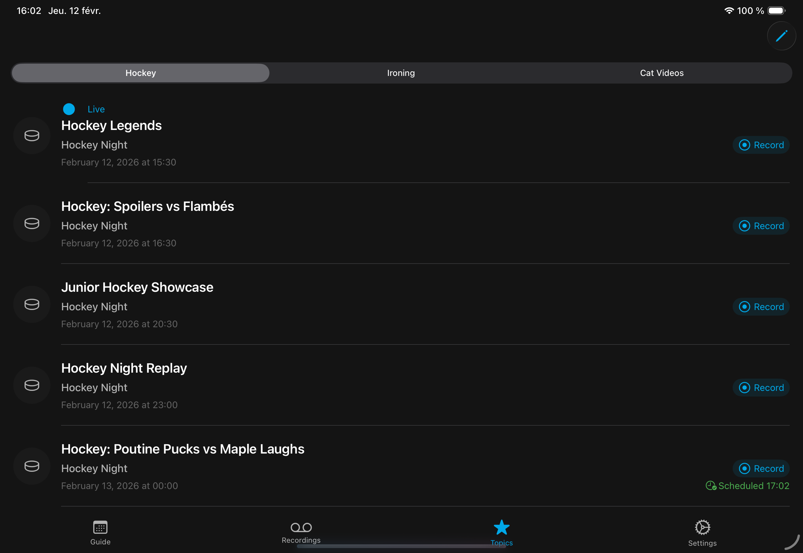

# NexusPVR

A native Apple client for [NextPVR](https://www.nextpvr.com/) and [Dispatcharr](https://github.com/Dispatcharr/Dispatcharr) DVR/PVR software. Built with SwiftUI, it runs on iOS, iPadOS, tvOS, and macOS from a single codebase. The supported backend is selected based on the target app scheme.

## Features

- **Electronic Program Guide** — Interactive grid with horizontal scrolling timeline, day navigation, program details, and one-tap recording scheduling
- **Live TV** — Browse channels and stream live television
- **Recordings** — View completed, in-progress, and scheduled recordings with resume playback support
- **Topics** — Keyword-based program discovery that scans the EPG and highlights upcoming shows matching your interests
- **Video Player** — Hardware-accelerated playback powered by MPV with Metal rendering and configurable seek times
- **Server Auto-Discovery** — Automatically detects servers on your local network
- **iCloud Sync** — Server configuration, keywords, and preferences sync across all your Apple devices
- **Demo Mode** — Explore the full app with built-in sample data, no server required
- **Platform-Adaptive UI** — Tab bar on iOS/iPadOS, top navigation on tvOS with Siri Remote support, sidebar on macOS

| Guide | Recordings | Topics |
|-------|------------|--------|
|  |  |  |

## Server Requirements

### NextPVR

- [NextPVR](https://www.nextpvr.com/) v5 or later
- Default port: **8866**
- Authentication: PIN (default `0000`)
- JSON API enabled (enabled by default)

### Dispatcharr

- [Dispatcharr](https://github.com/Dispatcharr/Dispatcharr) server
- Default port: **9191**
- Authentication: Username and password
- The Dispatcharr build includes an additional **stream status** view showing active proxy connections

## Supported Platforms

| Platform | Minimum Version |
|----------|----------------|
| iOS      | 26.0+          |
| iPadOS   | 26.0+          |
| tvOS     | 26.0+          |
| macOS    | 26.0+          |

## Build Instructions

1. Open `NexusPVR.xcodeproj` in Xcode 26+
2. Select a target:
   - **NexusPVR** — NextPVR client
   - **DispatcherPVR** — Dispatcharr client
3. Select a destination platform (iOS, tvOS, or macOS)
4. Build and run (`Cmd+R`)

MPVKit is fetched automatically by Swift Package Manager on first build.

### Dependencies

| Package | Purpose |
|---------|---------|
| [MPVKit](https://github.com/mpvkit/MPVKit) (0.41.0+) | libmpv wrapper for hardware-accelerated video playback |

## Demo Mode

Demo mode lets you explore the app without connecting to a server. It provides 8 simulated channels with a 3-day EPG, sample recordings, topic keywords, and video playback using a bundled clip.

### Activating Demo Mode

**NextPVR build:** Enter `demo` as the server host.

**Dispatcharr build:** Enter `demo` as the server host, *or* enter `demo` / `demo` as the username and password.

### What's Included

- **8 channels** with icons — SportsCenter HD, News 24/7, Hockey Night, The Movie Channel, Comedy Gold, Nature & Discovery, Premier League TV, Breaking News Now
- **3 days of EPG data** (yesterday, today, tomorrow) with program schedules per channel
- **Recordings** — 3 completed (one partially watched) and 2 scheduled
- **Topic keywords** — "Hockey", "Ironing", "Cat Videos" pre-configured
- **Recording management** — Schedule and cancel recordings interactively (session state, not persisted)
- **Video playback** — All streams play a bundled sample video

## Project Structure

```
NexusPVR/
├── Core/
│   ├── Models/          # Channel, Program, Recording, Session, UserPreferences
│   ├── Services/        # NextPVRClient, DispatcherClient, DemoDataProvider, ImageCache
│   └── Extensions/
├── Design/
│   └── Theme.swift      # Colors, spacing, typography, platform sizes
├── Features/
│   ├── Guide/           # EPG grid view
│   ├── LiveTV/          # Channel list and streaming
│   ├── Player/          # MPV video player
│   ├── Recordings/      # Recording management
│   ├── Settings/        # Server config, keyword editor
│   ├── Topics/          # Keyword-based program discovery
│   └── Stats/           # Stream status (Dispatcharr only)
└── Navigation/          # AppState, platform-adaptive NavigationRouter
```
