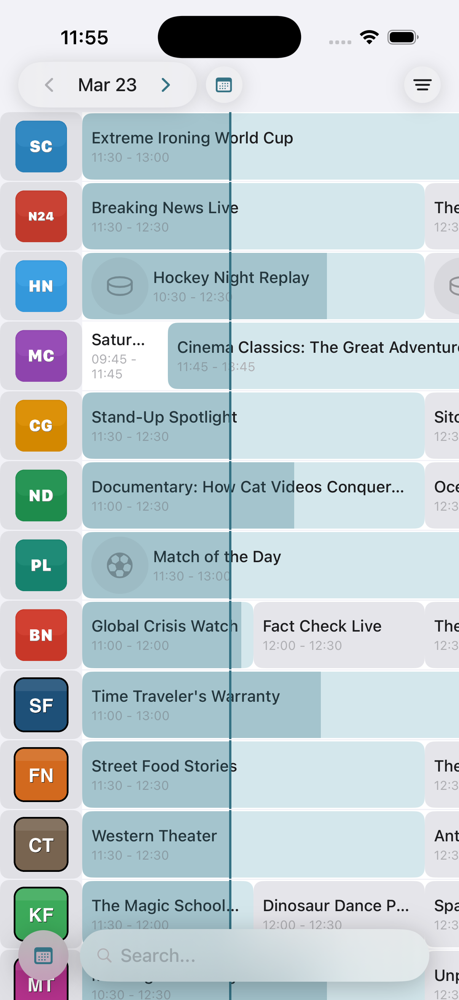
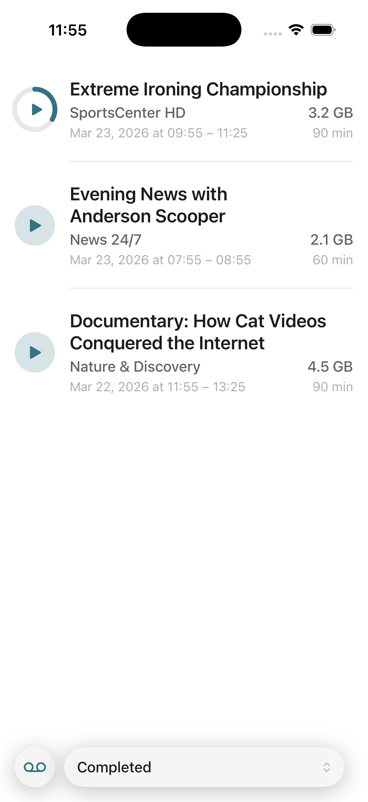
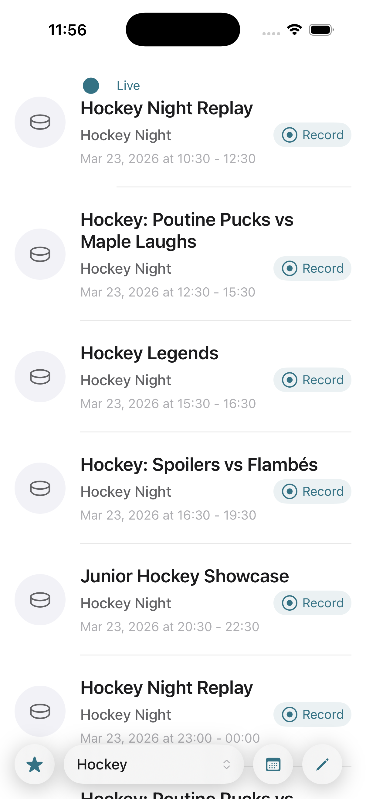
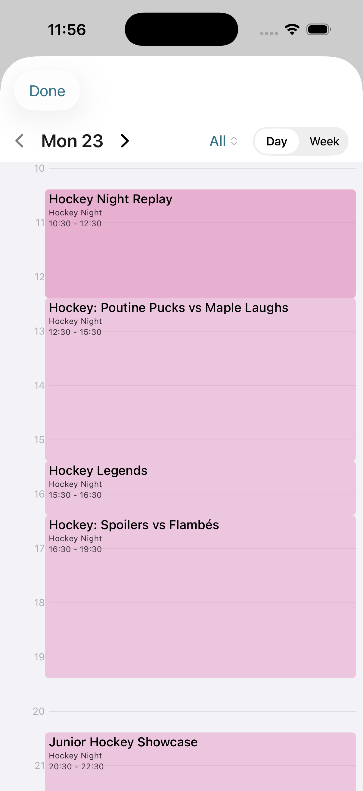
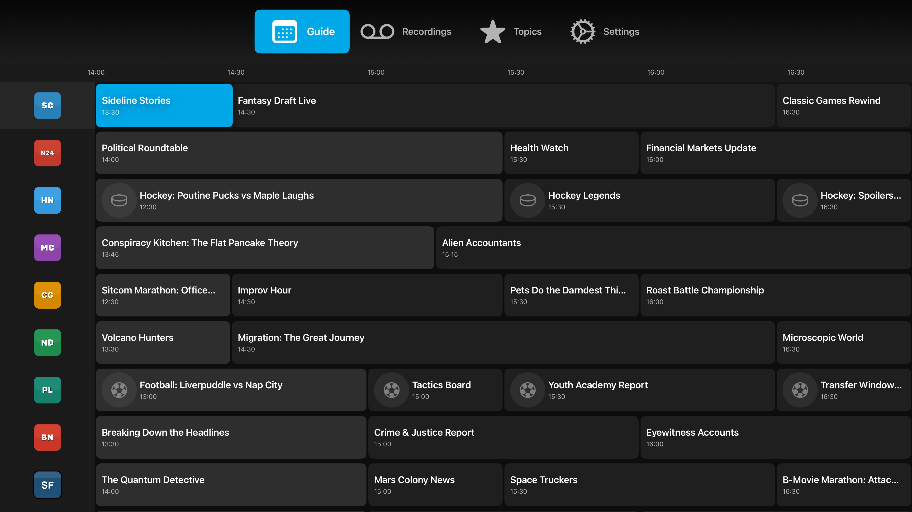

# StreamClient

A native Apple streaming client for PVR/DVR servers. Built with SwiftUI, StreamClient runs on iPhone, iPad, Apple TV, and Mac from a single codebase.

Two variants are available:
- **StreamClient - For NextPVR** — connects to [NextPVR](https://www.nextpvr.com/) servers
- **StreamClient** — connects to [Dispatcharr](https://github.com/Dispatcharr/Dispatcharr) servers

## Screenshots

| Guide | Recordings | Topics | Calendar |
|-------|------------|--------|----------|
|  |  |  |  |

**Apple TV**

## Features

### Electronic Program Guide
Interactive grid with horizontal scrolling timeline, pinned channel column, day navigation, and program details. Tap any program to view details or schedule a recording. Live programs show real-time progress. Filter channels by name, number, or group.

### Live TV
Browse channels with icons and start streaming with a single tap. Channels are searchable and support server-defined groups and profiles.

### Recordings
View completed, in-progress, and scheduled recordings. Resume playback from where you left off. Schedule or cancel recordings from anywhere in the app. Recordings show file size, duration, and quality details.

### Topics
Define keywords to automatically discover programs across the entire EPG. Matching shows are listed with live/upcoming status and one-tap recording. Great for tracking sports teams, shows, or any subject.

### Calendar
Day and week views of your topic matches laid out on a visual timeline. Color-coded by keyword for quick scanning. Tap any block to view details or record.

### Search
Full-text search across all program titles, subtitles, and descriptions. Results link directly to program details and recording controls.

### Video Player
Hardware-accelerated playback powered by MPV with Metal rendering. Features include:
- Configurable seek forward/backward durations
- Audio track selection
- Playback statistics overlay (FPS, bitrate, codec, dropped frames)
- Picture-in-Picture (iOS/iPadOS)
- Resume position tracking for recordings

### Sport Detection
Automatic sport icon recognition for 40+ sports from program metadata. Covers team sports, individual sports, motorsports, combat sports, winter sports, and water sports.

### Server Discovery
Automatically scans your local network to find PVR servers. No manual IP entry required.

### iCloud Sync
Server configuration, topic keywords, seek preferences, and audio settings sync across all your Apple devices via iCloud.

### Demo Mode
Explore the full app without a server. Provides 15 simulated channels across 5 groups, 3 days of EPG data, sample recordings, and pre-configured topic keywords. Enter `demo` as the server host to activate.

### Dispatcharr-Specific Features
- **Stream Status** — Live monitoring of active proxy streams and viewer counts
- **Channel Profiles** — Curated channel collections (Sports, News, Entertainment)
- **M3U Account Health** — Connection status indicators for your stream sources

## Platform Experience

| Platform | Navigation | Highlights |
|----------|-----------|------------|
| **iPhone / iPad** | Tab bar | Gesture-driven, Picture-in-Picture, landscape support |
| **Apple TV** | Top navigation bar | Siri Remote optimized, focus-driven UI, Top Shelf extension |
| **Mac** | Sidebar | Mouse/trackpad, window management, keyboard shortcuts |

## Supported Platforms

| Platform | Minimum Version |
|----------|----------------|
| iOS / iPadOS | 26.0+ |
| tvOS     | 26.0+ |
| macOS    | 26.0+ |

## Server Requirements

### NextPVR
- [NextPVR](https://www.nextpvr.com/) v5 or later
- Default port: **8866**
- Authentication: PIN (default `0000`)

### Dispatcharr
- [Dispatcharr](https://github.com/Dispatcharr/Dispatcharr) server
- Default port: **9191**
- Authentication: Username and password

## Build Instructions

1. Open `NexusPVR.xcodeproj` in Xcode 26+
2. Select a scheme:
   - **NextPVR** — StreamClient - For NextPVR
   - **DispatcharrPVR** — StreamClient
3. Select a destination (iOS, tvOS, or macOS)
4. Build and run (`Cmd+R`)

[MPVKit](https://github.com/mpvkit/MPVKit) is fetched automatically by Swift Package Manager on first build.

## License

See [LICENSE](LICENSE) for details.
