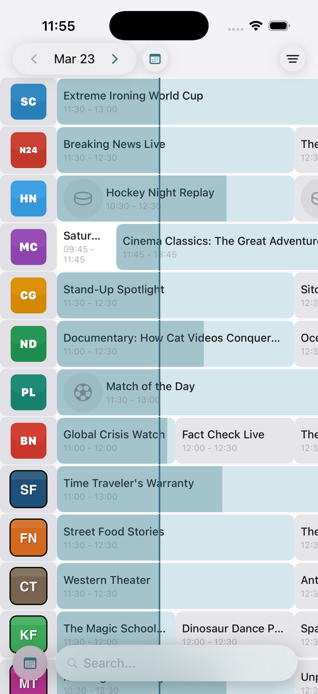
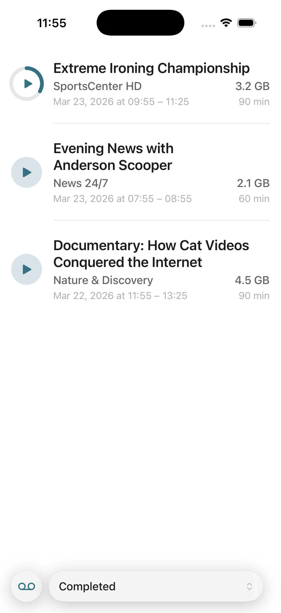
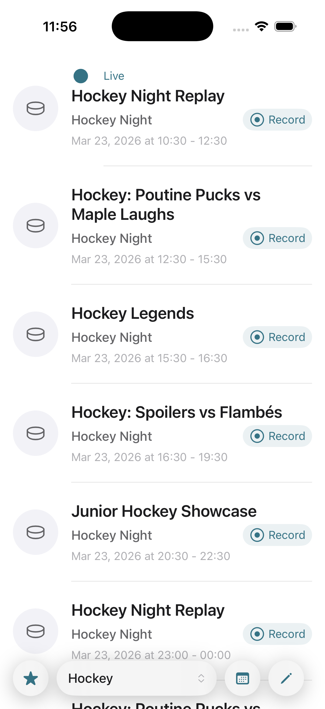
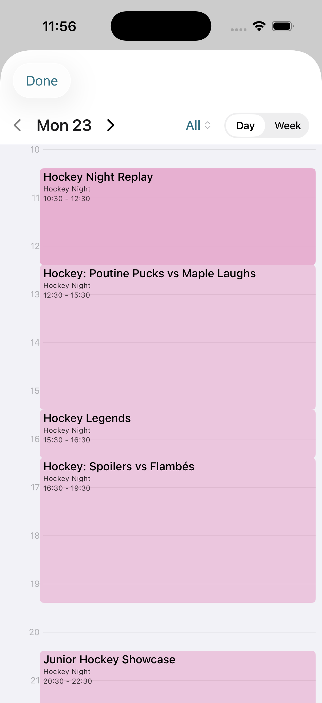
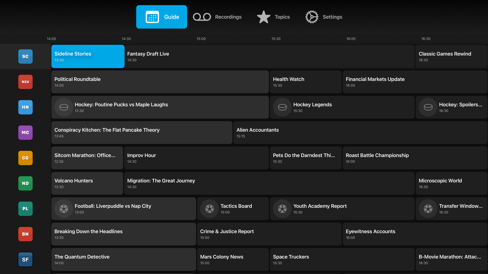

# StreamClient

A native Apple streaming client for PVR/DVR servers. Built with SwiftUI, StreamClient runs on iPhone, iPad, Apple TV, and Mac from a single codebase.

Two variants are available:
- **StreamClient - For NextPVR** — connects to [NextPVR](https://www.nextpvr.com/) servers
- **StreamClient** — connects to [Dispatcharr](https://github.com/Dispatcharr/Dispatcharr) servers

## Screenshots

| Guide | Recordings | Topics | Calendar |
|-------|------------|--------|----------|
|  |  |  |  |

**Apple TV**

## Features

### Electronic Program Guide
Interactive grid with horizontal scrolling timeline, pinned channel column, day navigation, and program details. Tap any program to view details or schedule a recording. Live programs show real-time progress. Filter channels by name, number, or group.

### Live TV
Browse channels with icons and start streaming with a single tap. Channels are searchable and support server-defined groups and profiles.

### Recordings
View completed, in-progress, and scheduled recordings. Resume playback from where you left off. Schedule or cancel recordings from anywhere in the app. Recordings show file size, duration, and quality details.

### Topics
Define keywords to automatically discover programs across the entire EPG. Matching shows are listed with live/upcoming status and one-tap recording. Great for tracking sports teams, shows, or any subject.

### Calendar
Day and week views of your topic matches laid out on a visual timeline. Color-coded by keyword for quick scanning. Tap any block to view details or record.

### Search
Full-text search across all program titles, subtitles, and descriptions. Results link directly to program details and recording controls.

### Video Player
Hardware-accelerated playback powered by MPV with Metal rendering. Features include:
- Configurable seek forward/backward durations
- Audio track selection
- Playback statistics overlay (FPS, bitrate, codec, dropped frames)
- Picture-in-Picture (iOS/iPadOS)
- Resume position tracking for recordings

### Sport Detection
Automatic sport icon recognition for 40+ sports from program metadata. Covers team sports, individual sports, motorsports, combat sports, winter sports, and water sports.

### Server Discovery
Automatically scans your local network to find PVR servers. No manual IP entry required.

### iCloud Sync
Server configuration, topic keywords, seek preferences, and audio settings sync across all your Apple devices via iCloud.

### Hide Recording Features
Playback-only setup? Enable **Hide Recording Features** in Settings → General to remove the Recordings tab and every record button and menu from the app. The preference syncs across your devices via iCloud.

### Demo Mode
Explore the full app without a server. Provides 15 simulated channels across 5 groups, 3 days of EPG data, sample recordings, pre-configured topic keywords, and (on the Dispatcharr variant) an on-demand library of movies and multi-season series. Enter `demo` as the server host to activate.

### Dispatcharr-Specific Features
- **On Demand** — Browse and play your providers' movies and series: search, categories, seasons and episodes, and resume where you left off on each device. The menu appears under Recordings when the server has VOD content
- **Stream Status** — Live monitoring of active proxy streams and viewer counts
- **Channel Profiles** — Curated channel collections (Sports, News, Entertainment)
- **M3U Account Health** — Connection status indicators for your stream sources

## Platform Experience

| Platform | Navigation | Highlights |
|----------|-----------|------------|
| **iPhone / iPad** | Tab bar | Gesture-driven, Picture-in-Picture, landscape support |
| **Apple TV** | Top navigation bar | Siri Remote optimized, focus-driven UI, Top Shelf extension |
| **Mac** | Sidebar | Mouse/trackpad, window management, keyboard shortcuts |

## Supported Platforms

| Platform | Minimum Version |
|----------|----------------|
| iOS / iPadOS | 26.0+ |
| tvOS     | 26.0+ |
| macOS    | 26.0+ |

## Server Requirements

### NextPVR
- [NextPVR](https://www.nextpvr.com/) v5 or later
- Default port: **8866**
- Authentication: PIN (default `0000`)

### Dispatcharr
- [Dispatcharr](https://github.com/Dispatcharr/Dispatcharr) server
- Default port: **9191**
- Authentication: Username and password

### Dispatcharr Role Access

For Dispatcharr users, access depends on `user_level`:
- `0` = Streamer
- `1` = Standard
- `10` = Admin

| Role | Access | No Access |
|------|--------|-----------|
| **Streamer** (`user_level = 0`) | Watch Live TV and browse Guide/Topics/Search/Settings | Recordings tab, Status tab, recording management (create/cancel/delete), proxy/M3U admin APIs |
| **Standard** (`user_level = 1`) | Everything Streamer can do, plus Recordings and Status navigation | Full recording management in detail views (admin required for create/cancel/delete controls) |
| **Admin** (`user_level = 10`) | Full access to all app features | None |

## Build Instructions

1. Open `NexusPVR.xcodeproj` in Xcode 26+
2. Select a scheme:
   - **NextPVR** — StreamClient - For NextPVR
   - **DispatcharrPVR** — StreamClient
3. Select a destination (iOS, tvOS, or macOS)
4. Build and run (`Cmd+R`)

[MPVKit](https://github.com/mpvkit/MPVKit) is fetched automatically by Swift Package Manager on first build.

## License

See [LICENSE](LICENSE) for details.

### Wi-Fi custom-host routing

On iOS and macOS, Settings → Server → Use Custom Host offers **Outside of Wi-Fi Network**.
Enter your home Wi-Fi name: the primary server address is used on that network,
while the custom host is used on every other network, including cellular,
Ethernet, or an unreadable/unknown Wi-Fi network. An empty configured name also
uses the custom host. Names match exact UTF-8 bytes: case, spaces, and Unicode
representation are significant; no trimming or normalization is applied.

The addresses and routing mode sync through iCloud. The Wi-Fi name is saved only
on this device, so configure it separately on each iPhone, iPad, or Mac. A device
that receives this mode without a local Wi-Fi name uses the custom host. Existing
On Cellular / On iPhone Hotspot and Always settings retain their behavior.

Use **Allow Wi-Fi Name Access** to request Location permission. Enable Precise
Location on iPhone/iPad. iOS builds require the Access Wi-Fi Information capability
(`com.apple.developer.networking.wifi-info`) in their provisioning profiles; the
project supplies this entitlement only for iOS ([Apple API requirements](https://developer.apple.com/documentation/systemconfiguration/cncopycurrentnetworkinfo)). Native macOS reads the SSID through
CoreWLAN and requires Location access on current macOS versions ([Apple explanation](https://developer.apple.com/forums/thread/732431)). No location fixes
are requested or collected. Permission denial, privacy restrictions, VPN routing,
and platform/API limitations can make the name unreadable; the custom host is the
fallback. Simulators cannot validate real Wi-Fi identification.

Routing is resolved for subsequent API, artwork, EPG, recording, live, and catch-up
requests and new playback URLs. Changes do not tear down an active player or clear
authentication or the EPG cache. tvOS and Top Shelf continue to use only the primary
server address and do not expose custom-host settings.
